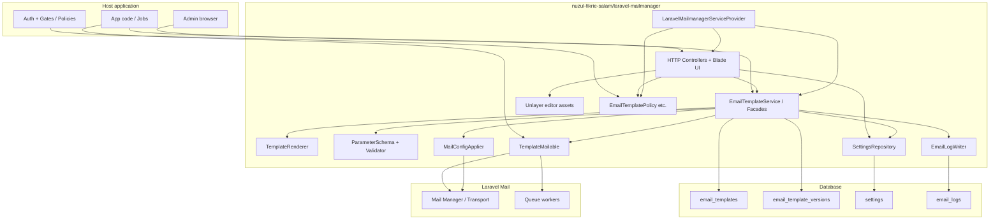
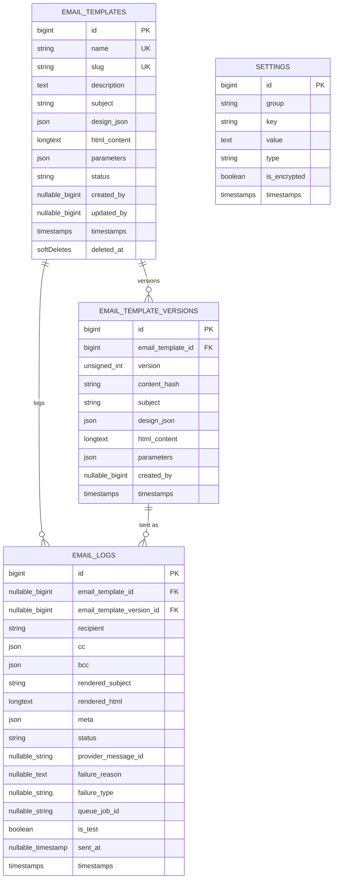
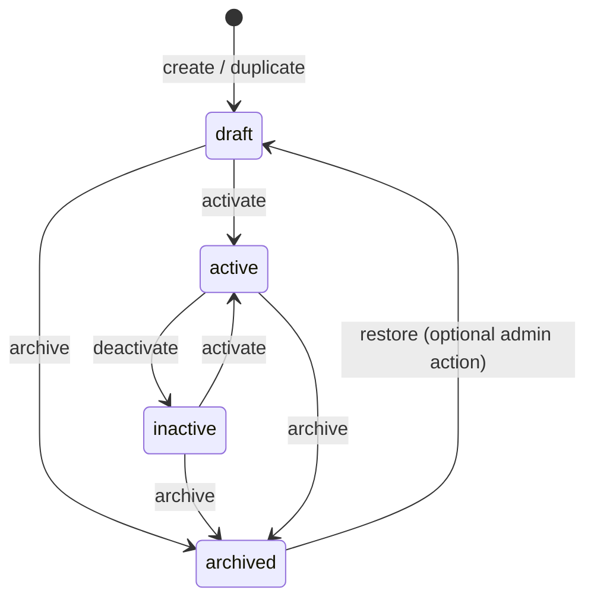
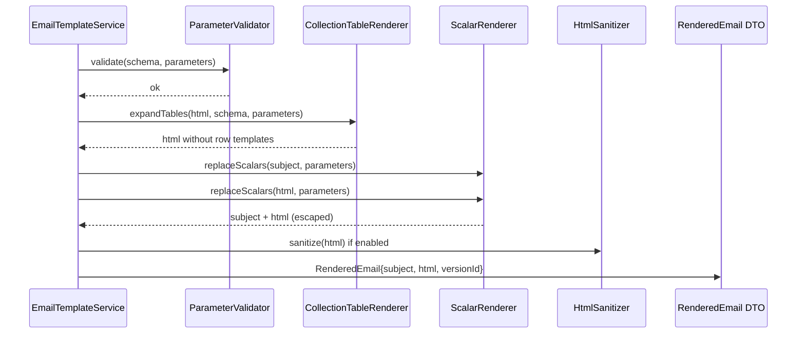
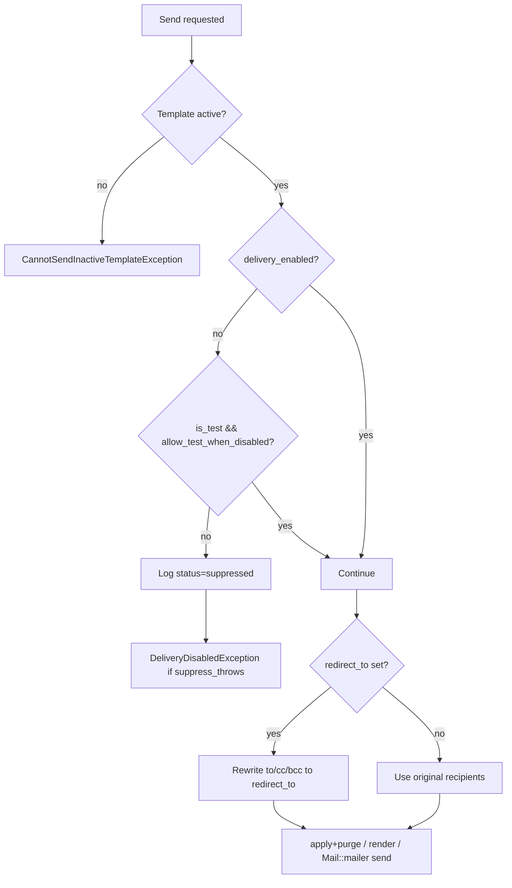
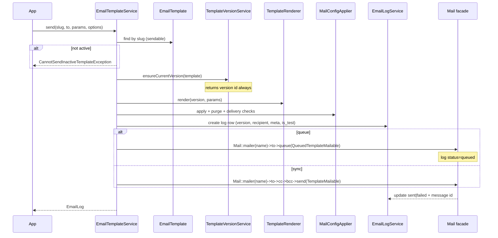
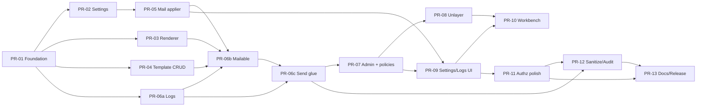

# Laravel Mailmanager — System Design Document

| Field | Value |
|---|---|
| **Document** | Laravel Mailmanager Full System Architecture |
| **Package** | `nuzul-fikrie-salam/laravel-mailmanager` |
| **Namespace** | `NuzulFikrieCoder\LaravelMailmanager` |
| **Author** | _TBD_ |
| **Date** | 2026-07-24 |
| **Status** | Draft (revised 2026-07-24 — design review) |
| **Source of truth (product)** | `.idea/task.md` |
| **Source of truth (roadmap)** | `ROADMAP.md` |
| **Related** | `CLAUDE.md`, `AGENTS.md`, `src/LaravelMailmanagerServiceProvider.php` |

---

## Overview

Laravel Mailmanager is a Laravel package that gives host applications a **centrally managed email template system**: visual design via Unlayer, typed scalar and collection parameters, encrypted SMTP settings stored in a package `settings` table, native Laravel Mail/Mailable/queue integration, delivery logs, and an optional Tailwind admin UI. The package today is a **scaffold only** — service provider, placeholder config/command/views/migration, empty facade class, and Orchestra Testbench workbench — with no domain models or send pipeline.

This design specifies the full architecture needed to ship the MVP defined in `ROADMAP.md` Phases 0–3: foundation schema, backend services (templates, renderer, mail, settings, logs), admin UI + Unlayer, and hardening (authz, sanitize, audit). The design prefers **Laravel-native package APIs**, explicit services over deep repository layers, and independently reviewable PRs aligned to the roadmap dependency map.

**Primary developer contracts:**

```php
EmailTemplateService::send(
    template: 'user-welcome',
    to: $user->email,
    parameters: ['name' => $user->name],
);

Mail::to($recipient)->send(
    new TemplateMailable(templateKey: 'user-welcome', parameters: [...])
);
```

---

## Background & Motivation

### Current state

| Asset | Location | State |
|---|---|---|
| Service provider | `src/LaravelMailmanagerServiceProvider.php` | Merges config, loads routes/views/lang, publishes tags, registers placeholder command + singleton |
| Config | `config/laravel-mailmanager.php` | Placeholder `['placeholder' => 'default']` |
| Domain class / facade | `src/LaravelMailmanager.php`, `src/Facades/LaravelMailmanager.php` | Empty; will collapse into domain facades |
| Routes | `routes/laravel-mailmanager.php` | Commented placeholder |
| Migration | `database/migrations/2026_01_01_000000_create_laravel_mailmanager_placeholder_table.php` | Placeholder table only |
| Views / lang / assets | `resources/views`, `lang/en`, `public/` | Placeholders / empty |
| Workbench | `workbench/` | Default Testbench skeleton (User + welcome route) |
| Tests | `tests/` | Arch + example Pest tests |
| Constraints | `composer.json` | PHP `^8.3`, `illuminate/support` `^12\|\|^13`, Pest 4, Testbench 10/11 |
| Placeholder Artisan | `src/Console/Commands/LaravelMailmanagerCommand.php` | Signature `laravel-mailmanager:placeholder` — **remove/replace in PR-01** (no domain value) |

### Pain points addressed

1. **Scattered email HTML** in apps (inline Blade, copy-paste subjects) with no non-developer edit path.
2. **No safe parameter model** for both string substitution and repeating invoice-style tables.
3. **SMTP credentials** often live only in `.env`; ops need UI-driven, encrypted, runtime-overridable settings without `config:cache` rebuilds.
4. **No delivery audit trail** tied to the template *version* actually sent.
5. **Unlayer** designs need a first-class store for both design JSON and exported HTML.

### Package conventions (must preserve)

From `CLAUDE.md` / `AGENTS.md`:

- Use Laravel-native package APIs and the existing service provider shape.
- Align names with `nuzul-fikrie-salam/laravel-mailmanager`.
- Add only needed files/dependencies.
- Prefer explicit package code over helper abstractions.
- Tests target **observable public behavior**: public APIs, provider wiring, commands, routes, published resources, documentation promises.

---

## Goals & Non-Goals

### Goals (MVP / first release)

1. Create/edit templates with Unlayer; store **design JSON** and **generated HTML** separately.
2. Template lifecycle status: `draft | active | inactive | archived` (not boolean).
3. Parameter schema JSON supporting **scalar** (`string|number|boolean|date|url`) and **collection** types.
4. Render `{param}` in subject/body; expand `data-email-collection` / `data-email-row-template` tables.
5. Validate parameters before send (required, types, strict unknown, malformed collections).
6. Send via `EmailTemplateService` and `TemplateMailable` with queue support.
7. SMTP configuration via `settings` table; **encrypted password**; blank password keeps existing.
8. Runtime override of Laravel mail config; `delivery_enabled` kill-switch; optional test-inbox redirect.
9. Test-send path; basic email delivery logs with template version capture.
10. Authorization via Laravel policies/gates (host app grants permissions).
11. Publish tags remain: `laravel-mailmanager`, `-config`, `-views`, `-lang`, `-assets`, `-migrations`.

### Non-Goals (v1.x+ / out of scope)

- Marketing campaign builder / audience lists.
- Built-in authentication (host app provides auth middleware/users).
- Multi-tenant isolation as a first-class package concern.
- Full ESP webhook ingestion matrix (SES/Postmark/etc.) beyond basic log fields.
- Alternative WYSIWYG editors.
- A/B testing of templates.
- Storing full parameter payloads in logs by default.
- Becoming a general-purpose settings framework beyond mail (+ minimal package groups).

---

## Proposed Design

### High-level architecture



### Directory layout (target)

**No `Contracts/` directory in MVP.** Concrete final classes only; interfaces wait for a second implementation (package convention: avoid helper abstractions without a real extension point).

```text
src/
  LaravelMailmanagerServiceProvider.php
  Console/Commands/
    InstallCommand.php                    # optional: seed default mail keys
    TestSmtpCommand.php                   # mailmanager:smtp-test
    SendTestTemplateCommand.php           # mailmanager:send-test (dev/ops)
  DTOs/
    SendOptions.php
    RenderedEmail.php
    ParameterDefinition.php
    CollectionColumn.php
  Enums/
    TemplateStatus.php                    # draft|active|inactive|archived
    EmailLogStatus.php                    # queued|sent|failed|suppressed
    EmailFailureType.php                  # validation|smtp_connection|smtp_auth|provider_reject|queue|suppressed
    SettingType.php                       # string|integer|boolean|float|json|encrypted
    EmptyCollectionBehavior.php           # hide|headers_message|custom_fallback|fail
    ParameterType.php                     # string|number|boolean|date|url|collection
    ColumnFormat.php                      # plain|integer|decimal|currency|date|datetime|percentage
  Exceptions/
    TemplateNotFoundException.php
    CannotSendInactiveTemplateException.php
    MissingRequiredParameterException.php
    UnknownParameterException.php
    InvalidParameterValueException.php
    InvalidCollectionException.php
    DeliveryDisabledException.php
    SmtpConfigurationException.php
  Facades/
    EmailTemplate.php                     # → EmailTemplateService (PR-04)
    MailmanagerSettings.php               # → SettingsRepository (PR-02)
    # LaravelMailmanager facade/alias deprecated in PR-13
  Http/
    Controllers/
      TemplateController.php
      TemplatePreviewController.php
      TemplateTestSendController.php
      SettingsController.php
      SmtpTestController.php
      EmailLogController.php
    Requests/
      StoreTemplateRequest.php
      UpdateTemplateRequest.php
      UpdateMailSettingsRequest.php
      SendTestEmailRequest.php
  Mail/
    TemplateMailable.php                  # does NOT implement ShouldQueue
    QueuedTemplateMailable.php            # extends TemplateMailable implements ShouldQueue
    RawHtmlMailable.php                   # MVP retry: subject + htmlString only; no template lookup
  Models/
    EmailTemplate.php
    EmailTemplateVersion.php
    Setting.php
    EmailLog.php
  Policies/                               # registered when UI ships (PR-07 / secure-by-default)
    EmailTemplatePolicy.php
    EmailLogPolicy.php
  Rendering/
    ParameterDetector.php
    ParameterValidator.php
    ScalarRenderer.php
    CollectionTableRenderer.php
    TemplateRenderer.php
    HtmlSanitizer.php
    Formatters/
      ValueFormatter.php
      CurrencyFormatter.php
      DateFormatter.php
  Services/
    EmailTemplateService.php              # CRUD + send/queue/test/render (no separate EmailSender)
    TemplateVersionService.php
    SettingsRepository.php
    MailConfigApplier.php
    EmailLogService.php
    SmtpProbeService.php
  Support/
    ReservedParameterNames.php
    Mask.php
  LaravelMailmanager.php                  # remove or re-export in PR-13

config/laravel-mailmanager.php            # FULL skeleton owned by PR-01
database/migrations/
  2026_07_24_000001_create_email_templates_table.php
  2026_07_24_000002_create_email_template_versions_table.php
  2026_07_24_000003_create_mailmanager_settings_table.php
  2026_07_24_000004_create_email_logs_table.php
database/factories/
  EmailTemplateFactory.php
  EmailTemplateVersionFactory.php
  SettingFactory.php
  EmailLogFactory.php
resources/views/
  layouts/admin.blade.php
  templates/...
  settings/mail.blade.php
  logs/index.blade.php
  logs/show.blade.php
  mail/template.blade.php
public/
  css/mailmanager.css                     # COMMITTED PREBUILT CSS (no Node required for consumers/CI)
  js/unlayer-bridge.js                    # committed static JS
  js/parameter-insert.js
routes/laravel-mailmanager.php
lang/en/{messages,validation,permissions}.php
tests/
  Feature/...
  Unit/Rendering/...
  Fixtures/html/
    welcome-scalar.html                   # golden
    invoice-collection.html               # golden (Unlayer-export facsimile)
    invoice-empty-hide.html
workbench/
  database/seeders/MailmanagerDemoSeeder.php
```

### Service provider wiring

Extend `LaravelMailmanagerServiceProvider` without inventing a new bootstrap style.

**Ownership:** PR-01 lands the **full config skeleton** + removes placeholder command/migration + leaves a commented “service bindings” block. Later PRs **only append** `singleton(...)` lines — they do not reshape config keys.

```php
public function register(): void
{
    $this->mergeConfigFrom(__DIR__.'/../config/laravel-mailmanager.php', 'laravel-mailmanager');

    // Bindings appended by PR-02+ (never rewrite this block wholesale):
    // $this->app->singleton(SettingsRepository::class);
    // $this->app->singleton(MailConfigApplier::class);
    // $this->app->singleton(TemplateRenderer::class);
    // $this->app->singleton(EmailTemplateService::class);
    // $this->app->singleton(EmailLogService::class);
    // $this->app->singleton(SmtpProbeService::class);
}

public function boot(): void
{
    if (config('laravel-mailmanager.ui.enabled', false)) {
        $this->loadRoutesFrom(__DIR__.'/../routes/laravel-mailmanager.php');
    }

    $this->loadViewsFrom(__DIR__.'/../resources/views', 'laravel-mailmanager');
    $this->loadTranslationsFrom(__DIR__.'/../lang', 'laravel-mailmanager');

    Gate::policy(EmailTemplate::class, EmailTemplatePolicy::class);
    Gate::policy(EmailLog::class, EmailLogPolicy::class);

    // Primary path: lazy apply on first send/probe (always correct after purge).
    // Optional boot apply: only when enabled AND not running unit tests.
    if (
        config('laravel-mailmanager.mail.apply_on_boot', false)
        && ! $this->app->runningUnitTests()
    ) {
        $this->app->booted(function () {
            try {
                if (! Schema::hasTable(config('laravel-mailmanager.tables.settings'))) {
                    return;
                }
                $this->app->make(MailConfigApplier::class)->apply();
            } catch (QueryException $e) {
                // migrate/first install — expected
                report($e); // or Log::debug
            } catch (DecryptException $e) {
                Log::warning('laravel-mailmanager: failed to decrypt mail settings (check APP_KEY)', [
                    'message' => $e->getMessage(),
                ]);
            }
            // Do NOT catch \Throwable — other errors must surface in non-test environments
        });
    }

    if ($this->app->runningInConsole()) {
        // publishes + migrations + commands (no laravel-mailmanager:placeholder)
    }
}
```

**Binding rule:** singletons only for services that hold cache/state (`SettingsRepository`, `MailConfigApplier`). Renderer and template service are concrete classes; bind as singletons for DI convenience, not as swap-able contracts.

### Config shape (`config/laravel-mailmanager.php`)

```php
return [
    'name' => 'Laravel Mailmanager',

    'tables' => [
        'templates' => 'email_templates',
        'template_versions' => 'email_template_versions',
        'settings' => 'mailmanager_settings', // avoid colliding with host `settings`
        'logs' => 'email_logs',
    ],

    'route' => [
        'prefix' => 'mailmanager',
        'name' => 'mailmanager.',
        'middleware' => ['web', 'auth'], // host may append 'can:...'
    ],

    'ui' => [
        // Secure-by-default: off until host enables after defining permission gates.
        // Workbench seeder / demo sets true. Policies deny when abilities undefined.
        'enabled' => (bool) env('MAILMANAGER_UI_ENABLED', false),
        'layout' => 'laravel-mailmanager::layouts.admin',
        'brand' => 'Mailmanager',
    ],

    'unlayer' => [
        'project_id' => env('MAILMANAGER_UNLAYER_PROJECT_ID'),
        'display_mode' => 'email',
        'locale' => 'en-US',
        'cdn' => 'https://editor.unlayer.com/embed.js',
        // host supplies license per Unlayer commercial terms
    ],

    'parameters' => [
        'strict' => (bool) env('MAILMANAGER_STRICT_PARAMETERS', false),
        'placeholder_pattern' => '/\{([a-zA-Z_][a-zA-Z0-9_]*)\}/',
        'html_escape_default' => true,
        'raw_opt_in_key' => 'allow_raw_html',
        'reserved_names' => ['app_name', 'app_url', 'year'],
        // Unresolved {tokens} after render:
        // - subject: always fail (missing personalization is never OK)
        // - body: fail only when strict=true OR fail_on_unresolved_body=true
        // Default: non-strict mode does NOT fail body leftovers (Unlayer CSS braces risk)
        'fail_on_unresolved_subject' => true,
        'fail_on_unresolved_body' => false,
    ],

    'mail' => [
        'mailer_name' => 'mailmanager', // dedicated mailer entry patched at runtime
        // Prefer false: primary path is apply()+purge on send/settings-save.
        // Boot apply is optional convenience for long-lived workers that never call send first.
        'apply_on_boot' => false,
        'set_as_default' => false, // never clobber host default mailer unless host opts in
        'apply_global_from' => false, // from is set on Mailable, not mail.from.*, by default
        'delivery_enabled_default' => true,
        'allow_test_when_disabled' => true,
        'suppress_throws' => true, // DeliveryDisabledException when kill-switch blocks send
        'redirect_to' => env('MAILMANAGER_REDIRECT_TO'),
        'queue_by_default' => false,
        'store_rendered_html_in_logs' => false,
        'log_parameter_keys' => false,
        // Worker re-check: if template no longer active when job runs, still send from version
        // snapshot (US-028). Set true to fail instead.
        'reject_if_template_inactive_on_worker' => false,
    ],

    'cache' => [
        // Multi-node: MUST use a shared store (redis/memcached). File/array cache will
        // leave other nodes with stale SMTP settings after rotate/kill-switch.
        'settings_store' => env('MAILMANAGER_CACHE_STORE'), // null = default cache store
        'settings_ttl' => 3600,
        'settings_key' => 'laravel-mailmanager.settings',
        // Always re-read settings from DB (or cache) on send before apply — do not rely on
        // boot-time apply alone for kill-switch correctness.
    ],

    'sanitizer' => [
        'enabled' => true,
        'strip_scripts' => true,
        'strip_event_handlers' => true,
    ],

    'permissions' => [
        // ability names; host maps roles → these via Gate::define or a package
        'templates.view' => 'email-templates.view',
        'templates.create' => 'email-templates.create',
        'templates.update' => 'email-templates.update',
        'templates.delete' => 'email-templates.delete',
        'templates.activate' => 'email-templates.activate',
        'templates.send_test' => 'email-templates.send-test',
        'settings.view' => 'email-settings.view',
        'settings.update' => 'email-settings.update',
        'logs.view' => 'email-logs.view',
        'logs.retry' => 'email-logs.retry',
    ],
];
```

**Table name note:** Use configurable `mailmanager_settings` by default to avoid clashing with popular host `settings` tables. Document override via `tables.settings`.

---

## Data Model Changes

### ER diagram



### `email_templates`

| Column | Type | Notes |
|---|---|---|
| `id` | bigint PK | |
| `name` | string(255) unique | Required; human label |
| `slug` | string(255) unique | API key (`user-welcome`); generated from name if omitted |
| `description` | text nullable | |
| `subject` | string(998) | RFC-practical subject length; may contain `{params}` |
| `design_json` | json nullable | Unlayer design document |
| `html_content` | longText | Unlayer export / final HTML before param render |
| `parameters` | json | Parameter **schema** object (not flat list) |
| `status` | string(32) | `draft\|active\|inactive\|archived`; index |
| `created_by` | foreignId nullable | No hard FK to users (host table unknown); unsignedBigInteger + index |
| `updated_by` | unsignedBigInteger nullable | |
| `created_at` / `updated_at` | timestamps | |
| `deleted_at` | softDeletes | Soft-deleted cannot send |

**Indexes:** unique(`name`), unique(`slug`), index(`status`), index(`deleted_at`).

**Model:** `EmailTemplate`  
**Casts:** `design_json` → `array`, `parameters` → `array`, `status` → `TemplateStatus` enum, `deleted_at` → datetime.  
**Relations:** `versions()`, `logs()`, `latestVersion()`.  
**Scopes:** `active()`, `sendable()` (`status === active` and not trashed), `status(TemplateStatus)`.

#### Status state machine (normative)

Task language “inactive until activated” maps to the enum as follows. UI copy may say “inactive” for any non-`active` template.



| Transition | From | To | Notes |
|---|---|---|---|
| create | — | `draft` | Default; not sendable (satisfies “inactive by default”) |
| duplicate | any | `draft` | New slug/name; content copied |
| activate | `draft` \| `inactive` | `active` | Only sendable status |
| deactivate | `active` | `inactive` | Not `draft` — preserves “was production” semantics |
| archive | any non-deleted | `archived` | Soft operational retirement; not sendable |
| restore | `archived` | `draft` | Optional; requires re-activate to send |
| soft-delete | any | deleted | Cannot send; separate from archive |

### `email_template_versions`

Immutable snapshot of **content hash fields**. Always referenced at send time via `email_template_version_id`.

| Column | Type | Notes |
|---|---|---|
| `id` | bigint PK | |
| `email_template_id` | FK cascade | |
| `version` | unsignedInteger | Monotonic per template; unique(`email_template_id`, `version`) |
| `content_hash` | string(64) | sha256 of canonical JSON of subject+html+design+parameters |
| `subject` | string | Snapshot |
| `design_json` | json nullable | Snapshot |
| `html_content` | longText | Snapshot used for render |
| `parameters` | json | Schema snapshot |
| `created_by` | unsignedBigInteger nullable | |
| timestamps | | No updates expected |

#### Version cadence (normative — closes Open Question #4)

1. **Content hash** = SHA-256 of a **canonical JSON encoding** of the four content fields (see algorithm below). Never hash raw Eloquent attribute arrays without canonicalization.
2. **On create:** if any content field is non-empty, insert **version 1** in the same DB transaction as the template row.
3. **On update:** compare new hash to latest version’s `content_hash`.
   - Hash **changed** → insert version N+1 (only content fields; description-only / `updated_by` / status-only edits do **not** create versions).
   - Hash **unchanged** → no version row.
4. **Concurrency:** when creating a version, `EmailTemplate::query()->whereKey($id)->lockForUpdate()->first()` then `max(version)+1` inside the transaction.
5. **`ensureCurrentVersion(EmailTemplate $t): EmailTemplateVersion`** (used at send):
   - Read latest version for template.
   - If **zero** versions (edge: empty create then later content without versioning bug), create version inline in a transaction with `lockForUpdate` — never send without a version id.
   - **Read-only** when a version already exists matching current hash; does **not** invent versions on every send if hash matches latest.
6. Sends **always** store `email_template_version_id` of the snapshot used for render. Queued jobs pass that id, not live template HTML.

##### Content-hash canonicalization (normative)

Associative `design_json` / `parameters` reloaded from DB or built via different write paths can have different key insertion order. PHP `json_encode` preserves insertion order, so **without recursive key sorting the same logical content can produce different hashes** (spurious version rows or missed bumps).

```php
/**
 * @param  array<string, mixed>  $designJson
 * @param  array<string, mixed>  $parameters
 */
public static function contentHash(
    string $subject,
    string $htmlContent,
    array $designJson,
    array $parameters,
): string {
    $payload = [
        'subject' => $subject,
        'html_content' => $htmlContent,
        'design_json' => self::canonicalize($designJson),
        'parameters' => self::canonicalize($parameters),
    ];

    // Named keys (not a positional list) so future fields can be added carefully.
    // Flags: no pretty-print spaces; unicode unescaped for stable UTF-8 emails.
    $json = json_encode(
        $payload,
        JSON_THROW_ON_ERROR | JSON_UNESCAPED_UNICODE | JSON_UNESCAPED_SLASHES
    );

    return hash('sha256', $json);
}

/**
 * Deep-copy with recursive ksort on every array (assoc and list).
 * List element order is preserved; only string keys are sorted.
 *
 * @param  mixed  $value
 * @return mixed
 */
private static function canonicalize(mixed $value): mixed
{
    if (! is_array($value)) {
        return $value;
    }

    $isList = array_is_list($value);
    $out = [];
    foreach ($value as $k => $v) {
        $out[$k] = self::canonicalize($v);
    }
    if (! $isList) {
        ksort($out, SORT_STRING);
    }

    return $out;
}
```

**Rules:**

| Rule | Value |
|---|---|
| Outer structure | Object with fixed keys `subject`, `html_content`, `design_json`, `parameters` (not a bare positional array) |
| Nested arrays | Recursive `canonicalize`: `ksort(SORT_STRING)` on associative arrays; **preserve** list order |
| `json_encode` flags | `JSON_THROW_ON_ERROR \| JSON_UNESCAPED_UNICODE \| JSON_UNESCAPED_SLASHES` — **no** `JSON_PRETTY_PRINT`, **no** spaces |
| Null / empty | `design_json` null treated as `[]` before hash; empty string subject/html allowed |
| Floats | Leave as PHP encodes them; avoid mixing string `"1.0"` vs float `1.0` in schema writers (validators normalize types on save) |

**Pest (PR-04):** same logical `parameters` / `design_json` with keys inserted in different order → **identical** `content_hash`; changing one nested value → different hash.

### `mailmanager_settings` (logical name: Setting model)

| Column | Type | Notes |
|---|---|---|
| `id` | bigint PK | |
| `group` | string(64) | e.g. `mail` |
| `key` | string(128) | e.g. `password` |
| `value` | text nullable | Encrypted ciphertext when `is_encrypted` |
| `type` | string(32) | `SettingType` |
| `is_encrypted` | boolean default false | |
| timestamps | | |

**Indexes:** unique(`group`, `key`), index(`group`).

### `email_logs` (final MVP columns — ER and migration must match)

| Column | Type | Notes |
|---|---|---|
| `id` | bigint PK | |
| `email_template_id` | FK nullOnDelete | Retain logs if template hard-deleted later |
| `email_template_version_id` | FK nullOnDelete | US-028 |
| `recipient` | string(320) | Envelope “to” as delivered (after redirect rewrite if any) |
| `cc` / `bcc` | json nullable | arrays of addresses as delivered |
| `rendered_subject` | string | After param substitution; no HTML |
| `rendered_html` | longText nullable | Populated only when `mail.store_rendered_html_in_logs=true` |
| `meta` | json nullable | **MVP column** — not deferred. Holds structured non-secret context, e.g. `{ "original_recipient": "...", "original_cc": [], "redirected": true, "parameter_keys": ["name"] }` |
| `status` | string(32) | `EmailLogStatus` |
| `provider_message_id` | string nullable | |
| `failure_reason` | text nullable | Sanitized |
| `failure_type` | string(64) nullable | `EmailFailureType` |
| `queue_job_id` | string nullable | |
| `is_test` | boolean default false | |
| `sent_at` | timestamp nullable | |
| timestamps | | |

**Indexes:** (`status`, `created_at`), (`email_template_id`, `created_at`), (`recipient`), (`is_test`), (`failure_type`).

**Do not store** parameter **values** by default (US-022). Optional: `meta.parameter_keys` (names only) when `log_parameter_keys=true`.

#### Retry policy (MVP — closes Open Question #6 / US-023)

| Case | MVP behavior |
|---|---|
| Log has `rendered_html` + `rendered_subject` (store-html config was on at send) and failure is transport/provider/queue | **Eligible:** re-send stored HTML/subject via `RawHtmlMailable` (`src/Mail/RawHtmlMailable.php` — subject + `htmlString` only; no template lookup, no parameters) |
| Failure is `validation` / missing params / inactive template | **Not eligible** |
| No stored HTML | **Not eligible** — API returns **422** with message to supply parameters and call `EmailTemplateService::send` again; UI shows explanation, no fake retry button that stores PII |
| Phase 4 | Optional encrypted parameter vault + full retry UI (roadmap Phase 4) |

**MVP admin UI:** logs are **view + filter + detail**. Retry action ships only when `rendered_html` is present; otherwise button disabled with tooltip. Route `logs.retry` exists but enforces eligibility. Do **not** store parameters to make retry work in MVP.

### Soft deletes

- Templates: soft delete; `EmailTemplateService::send` rejects trashed + non-active.
- Versions/logs/settings: hard delete only via explicit admin/ops (no soft delete).
- Protected templates: Phase 3 `is_system` boolean **or** config list of protected slugs — prefer config `protected_slugs` to avoid schema churn in MVP.

### Seed mail settings keys (`group = mail`)

| key | type | encrypted | default |
|---|---|---|---|
| `mailer` | string | no | `smtp` |
| `host` | string | no | null |
| `port` | integer | no | 587 |
| `username` | string | no | null |
| `password` | string | **yes** | null |
| `encryption` | string | no | UI/storage key: `none` \| `tls` \| `ssl` → mapped to `scheme` + Symfony `auto_tls`/`require_tls` (not a mailer `encryption` key) |
| `from_address` | string | no | null |
| `from_name` | string | no | null |
| `reply_to` | string | no | null |
| `timeout` | integer | no | 30 |
| `delivery_enabled` | boolean | no | true |
| `redirect_to` | string | no | null |

---

## HTML / Parameter Renderer Contract

### Parameter schema (stored on template + version)

```json
{
  "customer_name": {
    "type": "string",
    "required": true,
    "label": "Customer name",
    "allow_raw_html": false
  },
  "invoice_number": {
    "type": "string",
    "required": true
  },
  "invoice_items": {
    "type": "collection",
    "required": true,
    "empty_behavior": "headers_message",
    "empty_message": "No invoice items are available.",
    "columns": [
      {
        "field": "description",
        "label": "Description",
        "format": "plain",
        "alignment": "left",
        "fallback": "-"
      },
      {
        "field": "quantity",
        "label": "Quantity",
        "format": "integer",
        "alignment": "right",
        "fallback": "0"
      },
      {
        "field": "unit_price",
        "label": "Unit Price",
        "format": "currency",
        "currency": "MYR",
        "alignment": "right",
        "fallback": "-"
      },
      {
        "field": "total",
        "label": "Total",
        "format": "currency",
        "currency": "MYR",
        "alignment": "right"
      }
    ]
  }
}
```

**Key rules:**

- Keys: `^[a-zA-Z_][a-zA-Z0-9_]*$`; unique; not in `parameters.reserved_names`.
- Types: `string|number|boolean|date|url|collection`.
- Collection must define `columns[]` with at least one field.
- `empty_behavior`: `hide | headers_message | custom_fallback | fail` (`EmptyCollectionBehavior`).

### Detection (`ParameterDetector`)

1. Scan `subject` + `html_content` with `parameters.placeholder_pattern`.
2. Collect unique scalar names appearing as `{name}`.
3. Scan HTML for `data-email-collection="name"` → mark collection keys.
4. Diff vs schema:
   - Detected but undefined → suggest add (UI warning; auto-add as `string` optional on save if config allows).
   - Defined but unused → UI warning only; send still OK.
5. Collection column placeholders appear only inside row templates and are **not** top-level parameters.

### Validation (`ParameterValidator`)

Given schema + runtime `$parameters` + config `strict`:

| Rule | Behavior |
|---|---|
| Missing required scalar/collection | `MissingRequiredParameterException` |
| Unknown top-level key + strict | `UnknownParameterException` |
| Unknown key + non-strict | ignore |
| Type mismatch (e.g. collection not array) | `InvalidParameterValueException` / `InvalidCollectionException` |
| Collection row not array/object | fail send |
| Collection empty + `empty_behavior=fail` | fail send |
| `url` type | `filter_var FILTER_VALIDATE_URL` |
| `date` type | parseable by `Carbon::parse` or Y-m-d |
| Optional missing scalar | render empty string (or schema `fallback` if present) |

### Render pipeline (`TemplateRenderer`)



#### Step 1 — Collection expansion (normative contract)

**Input markers (stable package contract):**

```html
<table data-email-collection="invoice_items">
  <thead>...</thead>
  <tbody>
    <tr data-email-row-template>
      <td>{description}</td>
      <td>{quantity}</td>
      <td>{unit_price}</td>
      <td>{total}</td>
    </tr>
  </tbody>
</table>
```

##### Collection contract normative rules

| Rule | Behavior |
|---|---|
| Host element | Prefer `<table>`. **Also allow** any element with `data-email-collection` (div/section) for Unlayer wrappers — expand the host element the same way. |
| Missing `data-email-row-template` descendant | **Fail fast** at render: `InvalidCollectionException` (“collection X has no row template”). |
| Multiple `data-email-row-template` in one collection host | Use **first** in document order; **remove** any additional row-template nodes without cloning them; log debug once. Do not clone all. |
| Nested `data-email-collection` | Expand **innermost first** (depth-first post-order) so outer tables see expanded HTML. Nested collections are supported but discouraged in Unlayer UI docs. |
| Nested plain tables (no data attr) | Untouched. |
| Expansion order vs scalars | **Collections first**, then scalar replace on subject + HTML. Column tokens `{description}` only substituted inside row clones; leftover `{description}` outside any collection is treated as a **top-level scalar** name in Step 2/3 (usually unresolved → subject/body rules). Schema should not reuse collection column field names as top-level scalar keys (validator warning). |
| Alignment | Apply as **inline** `style="text-align:left\|center\|right"` on the cell (email-client safe). No CSS classes for alignment in MVP. |
| Visibility (US-011) | **Phase 4** — column `visible: false` ignored in MVP (all columns in schema render). |
| Unknown column fields in a row | Ignore (non-strict) or fail row in strict mode. |
| Empty collection | Per `empty_behavior` (below). |
| After expand | Remove `data-email-row-template` from clones; remove original template row; remove `data-email-collection` attribute from host. |

**Empty collection:**

- `hide`: remove entire host element.
- `headers_message` / `custom_fallback`: remove template row; inject one message row/cell with `empty_message` (escaped).
- `fail`: blocked earlier in validator.

**Per-row algorithm:**

1. Clone row template node.
2. For each schema column: format value → HTML-escape (unless column `allow_raw_html`) → replace `{field}` tokens in clone **only**.
3. Apply alignment inline style on each `<td>`/`th` that contains that field’s primary cell (first cell containing the token).
4. Append clone; remove original template row.

##### Formatter matrix (MVP inputs → outputs)

| Format | Input examples | Output (string) | Notes |
|---|---|---|---|
| `plain` | any scalar | string cast | HTML-escaped after |
| `integer` | `12`, `"12.0"` | `12` | `number_format((int), 0, '.', '')` |
| `decimal` | `12.5` | `12.50` | 2 dp, `.` decimal, no thousands sep |
| `currency` | `1500`, currency `MYR` | `MYR 1,500.00` | Code prefix + `number_format($n, 2, '.', ',')`. Symbol maps optional later (`MYR`→`RM` config table). Locale fixed `en` for MVP reproducibility. |
| `date` | `2026-07-24`, Carbon, timestamp | `2026-07-24` | `Y-m-d` via Carbon parse; invalid → `InvalidParameterValueException` |
| `datetime` / `percentage` | — | Phase 4 | |

##### Mandated `DOMDocument` load/save recipe

```php
$wrapped = '<div id="mailmanager-root">'.$html.'</div>';
$dom = new DOMDocument('1.0', 'UTF-8');
$prev = libxml_use_internal_errors(true);
// Convert to HTML entities for libxml if needed:
$loaded = $dom->loadHTML(
    '<?xml encoding="UTF-8">'.$wrapped,
    LIBXML_HTML_NODEFDTD // do NOT use HTML_NOIMPLIED alone on full Unlayer documents
);
libxml_clear_errors();
libxml_use_internal_errors($prev);
// ... mutate nodes under #mailmanager-root ...
$root = $dom->getElementById('mailmanager-root');
$htmlOut = '';
foreach ($root->childNodes as $child) {
    $htmlOut .= $dom->saveHTML($child);
}
```

**Requirements:**

- Preserve Unlayer conditional comments and void tags as best-effort; golden fixtures must include at least one **Unlayer-export facsimile** (`tests/Fixtures/html/invoice-collection.html`) with full email HTML skeleton (`<!DOCTYPE html>`, tables, inline styles).
- Do not re-encode already-escaped entities twice.
- Unit tests pin load/save round-trip for that fixture (markers stripped, rows expanded).

#### Step 2 — Scalar replacement

- Apply to **subject** and **HTML** after collection expansion.
- Pattern: full `{param}` tokens matching `placeholder_pattern` only.
- Default: `htmlspecialchars($value, ENT_QUOTES | ENT_SUBSTITUTE, 'UTF-8')` for HTML body.
- Subject: stringify + strip tags (plain text).
- `allow_raw_html: true` on schema: unescaped (admin opt-in; Phase 3 gated).
- Booleans → `true`/`false` strings in MVP.
- Numbers → plain string cast unless later scalar formatters exist.

#### Step 3 — Unresolved placeholders (precise)

After render, scan with `placeholder_pattern` only (not arbitrary `{` in CSS):

| Location | `strict=false` (default) | `strict=true` |
|---|---|---|
| **Subject** | Fail if any token remains (`fail_on_unresolved_subject` default **true**) | Fail |
| **Body** | Leave tokens as-is unless `fail_on_unresolved_body=true` (default **false**) | Fail if any token remains |

Rationale: Unlayer/CSS can contain braces; body fail-open when non-strict avoids false-positive send failures. Subjects must never ship with `{name}` leftovers.

Document for authors: **do not** put raw `{foo}` in design except intentional placeholders.

### Public renderer API (concrete class — no interface in MVP)

```php
namespace NuzulFikrieCoder\LaravelMailmanager\Rendering;

final class TemplateRenderer
{
    /**
     * @param  array<string, mixed>  $parameters
     */
    public function render(
        EmailTemplate|EmailTemplateVersion $source,
        array $parameters,
        ?bool $strict = null,
    ): RenderedEmail {
        // strict null → config parameters.strict
    }
}
```

```php
final readonly class RenderedEmail
{
    public function __construct(
        public string $subject,
        public string $html,
        public ?int $templateId,
        public ?int $versionId,
    ) {}
}
```

**Tests:** golden fixtures under `tests/Fixtures/html/` — `welcome-scalar.html`, `invoice-collection.html` (Unlayer facsimile), empty-table variants, missing-row-template throws.

---

## Runtime SMTP Override & Delivery Kill-Switch

### Settings repository

```php
// Conceptual API
SettingsRepository::group('mail'): array; // casted key => value (password decrypted in-memory only)
SettingsRepository::get('mail', 'host'): mixed;
SettingsRepository::set('mail', 'password', $plain, encrypted: true): void;
SettingsRepository::putMany('mail', $validated): void; // blank password key omitted → keep existing
SettingsRepository::forgetCache(): void;
```

- Cache key: `config('laravel-mailmanager.cache.settings_key').'.'.$group`.
- Invalidate on any write to that group.
- Encrypted values: `Crypt::encryptString` / `decryptString`; `is_encrypted=true`.
- API/UI serialization: never include decrypted password; return `password_set: bool` + masked `********`.

### MailConfigApplier (Laravel 12/13-correct)

Maps stored `mail` settings → Laravel mailer config **and purges** `Illuminate\Mail\MailManager` so cached transports are not reused.

Verified against framework: `MailManager::createSmtpTransport()` reads **`$config['scheme']`** (not `encryption`); defaults to `smtps` when port is 465 else `smtp`. SMTP mailer shape in `config/mail.php`:

`transport`, `scheme`, `url`, `host`, `port`, `username`, `password`, `timeout`, `local_domain`.

#### UI `encryption` → Laravel mailer TLS options (normative)

Laravel 12/13 `MailManager::createSmtpTransport()` builds a Symfony DSN with `scheme` and forwards the **entire mailer config array** as DSN options. Symfony `EsmtpTransportFactory` defaults **`auto_tls` to true** when the option is omitted — so `scheme=smtp` alone still opportunistically upgrades via STARTTLS when the server advertises it. That would make product choices **None** and **TLS** behave the same unless we set DSN options explicitly.

| Settings `encryption` (stored) | `scheme` | DSN options on mailer config | Effective behavior | Typical port |
|---|---|---|---|---|
| `none` / empty / `null` | `smtp` | `auto_tls` => **false** | True plain SMTP; **no** opportunistic STARTTLS | 25 / 587 (no TLS) |
| `tls` / `starttls` | `smtp` | `auto_tls` => **true**, `require_tls` => **true** | STARTTLS required (fail closed if server has no TLS) | 587 |
| `ssl` / `smtps` | `smtps` | (implicit TLS; `auto_tls` N/A) | SMTPS / implicit TLS from connect | 465 |

**Notes:**

- **Never** write a top-level mailer key `encryption` as the sole TLS control — it is **ignored** by `MailManager` on Laravel 12/13. Keep `encryption` only as the **settings table** / UI key for US-017.
- `auto_tls` and `require_tls` are Symfony DSN options that Laravel already passes through via the mailer config array (verified: `EsmtpTransportFactory` reads both).
- Product **TLS** uses `require_tls=true` so “TLS” is fail-closed, not “try STARTTLS if available.”
- README: document that **None** disables STARTTLS entirely (some cloud SMTP relays require TLS — operators should pick `tls`/`ssl` for those providers).

#### Exact apply payload

```php
public function apply(): void
{
    $mail = $this->settings->group('mail'); // password decrypted in memory only
    $mailerName = config('laravel-mailmanager.mail.mailer_name', 'mailmanager');
    $tls = $this->mapEncryptionToMailerTls($mail['encryption'] ?? 'tls');

    $payload = [
        'transport' => $mail['mailer'] ?? 'smtp', // smtp|sendmail|log|array|...
        'scheme' => $tls['scheme'],               // smtp|smtps — NOT "encryption"
        'host' => $mail['host'] ?? null,
        'port' => (int) ($mail['port'] ?? 587),
        'username' => $mail['username'] ?? null,
        'password' => $mail['password'] ?? null,
        'timeout' => $mail['timeout'] ?? 30,
        'url' => null,
        'local_domain' => $mail['local_domain'] ?? null,
        // Symfony DSN options (forwarded by MailManager into EsmtpTransportFactory):
        'auto_tls' => $tls['auto_tls'],
        'require_tls' => $tls['require_tls'],
    ];

    // Drop null optional keys that would confuse DSN; keep password/username keys even if null
    Config::set("mail.mailers.{$mailerName}", array_filter(
        $payload,
        fn ($v, $k) => $v !== null || in_array($k, ['password', 'username'], true),
        ARRAY_FILTER_USE_BOTH
    ));

    if (config('laravel-mailmanager.mail.set_as_default', false)) {
        Config::set('mail.default', $mailerName);
    }

    // Global mail.from.* only when host explicitly opts in (default false).
    // Preferred: TemplateMailable sets ->from() / ->replyTo() from settings.
    if (config('laravel-mailmanager.mail.apply_global_from', false) && ! empty($mail['from_address'])) {
        Config::set('mail.from.address', $mail['from_address']);
        Config::set('mail.from.name', $mail['from_name'] ?? '');
    }

    // CRITICAL: Config::set alone does not rebuild cached transports.
    $manager = $this->app->make(MailManager::class);
    $manager->purge($mailerName);
    if (config('laravel-mailmanager.mail.set_as_default', false)) {
        $manager->purge(); // purge default mailer name as well
    }
}

/**
 * @return array{scheme: string, auto_tls: bool|null, require_tls: bool|null}
 */
private function mapEncryptionToMailerTls(null|string $encryption): array
{
    return match (strtolower((string) $encryption)) {
        'ssl', 'smtps' => [
            'scheme' => 'smtps',
            'auto_tls' => null,      // omit / irrelevant for smtps
            'require_tls' => null,
        ],
        'none', '', 'null' => [
            'scheme' => 'smtp',
            'auto_tls' => false,     // disable opportunistic STARTTLS
            'require_tls' => false,
        ],
        'tls', 'starttls' => [
            'scheme' => 'smtp',
            'auto_tls' => true,
            'require_tls' => true,   // fail closed if server has no TLS
        ],
        default => [
            'scheme' => 'smtp',
            'auto_tls' => true,
            'require_tls' => true,
        ],
    };
}
```

**Pest (PR-05):** assert mailer config for `encryption=none` includes `scheme=smtp` and `auto_tls=false`; for `tls` includes `require_tls=true`; for `ssl` includes `scheme=smtps`.

#### When applied (always write config + purge)

1. **Primary:** immediately before every send / queue dispatch / SMTP probe (`EmailTemplateService`).
2. Immediately after settings save in admin/API.
3. Optional `apply_on_boot` (default **false**): see service provider — only when table exists; never swallow decrypt errors.

**Pest coverage (required for PR-05):** resolve mailer once → change host/password in settings → `apply()` → assert subsequent transport uses new credentials **or** assert `MailManager::purge` invoked and config keys match expected Laravel 12 shape (`scheme` present, `encryption` absent on mailer array).

**Password blank-on-update:** form omits or empty string → repository does not overwrite `password` key.

**Multi-node cache:** settings cache store must be shared (Redis); file/array cache causes stale kill-switch/password on other nodes. On send, `group('mail')` still goes through repository (cache TTL); prefer short TTL or always `forgetCache` on write (already required). Document in README ops section.

### Delivery kill-switch



**Policy choices (MVP defaults):**

- Production sends when disabled: log `suppressed` + throw `DeliveryDisabledException` when `mail.suppress_throws=true` (default). When `false`, return the log row without throwing (batch jobs).
- Test sends when disabled: allowed if `allow_test_when_disabled`.
- `redirect_to`: rewrite envelope; store **delivered** addresses in `recipient`/`cc`/`bcc`; store originals in `meta.original_recipient` / `meta.original_cc` / `meta.redirected=true`.

### SMTP probe

`SmtpProbeService::sendTest(string $to): void` calls `MailConfigApplier::apply()` then sends a minimal message via `Mail::mailer($mailerName)`. Catch transport exceptions; **sanitize** via `Mask`. Artisan: `php artisan mailmanager:smtp-test {email}`.

---

## Laravel Mail Integration

### `EmailTemplateService` (primary API)

```php
final class EmailTemplateService
{
    public function send(
        string $template,              // slug
        string|array $to,
        array $parameters = [],
        SendOptions|array $options = [],
    ): EmailLog { /* ... */ }

    public function queue(...): EmailLog { /* ... */ }

    public function sendTest(
        string $template,
        string $to,
        array $parameters = [],
    ): EmailLog { /* ... */ }

    public function render(string $template, array $parameters = []): RenderedEmail { /* ... */ }

    // CRUD used by HTTP + programmatic setup
    public function create(array $data, ?int $actorId = null): EmailTemplate;
    public function update(EmailTemplate $template, array $data, ?int $actorId = null): EmailTemplate;
    public function duplicate(EmailTemplate $template, ?string $name = null): EmailTemplate;
    public function activate(EmailTemplate $template, ?int $actorId = null): EmailTemplate;
    public function deactivate(EmailTemplate $template, ?int $actorId = null): EmailTemplate;
    public function archive(EmailTemplate $template, ?int $actorId = null): EmailTemplate;
    public function delete(EmailTemplate $template): void;
}
```

```php
final readonly class SendOptions
{
    public function __construct(
        public string|array|null $cc = null,
        public string|array|null $bcc = null,
        public string|array|null $replyTo = null,
        /** @var list<string|\Illuminate\Mail\Mailables\Attachment> paths or serializable Attachment */
        public array $attachments = [],
        public bool $queue = false,
        public ?string $queueConnection = null,
        public ?string $queueName = null,
        public bool $isTest = false,
        public ?bool $strict = null,
        public ?string $mailer = null, // default package mailer_name
    ) {}
}
```

### Send sequence



Envelope application (normative):

```php
$mailer = Mail::mailer($options->mailer ?? config('laravel-mailmanager.mail.mailer_name'));
$pending = $mailer->to($to);
if ($cc) { $pending->cc($cc); }
if ($bcc) { $pending->bcc($bcc); }
// replyTo / from set on mailable from settings + options
$pending->send($mailable); // or ->queue($queuedMailable)
```

### `TemplateMailable` / `QueuedTemplateMailable` (normative — closes OQ #2)

**Key Decision 19:** `TemplateMailable` does **not** implement `ShouldQueue`. Queuing uses `QueuedTemplateMailable extends TemplateMailable implements ShouldQueue`, or `Mail::queue(new TemplateMailable(...))` only if the host explicitly queues a non-ShouldQueue mailable (Laravel supports queueing any mailable via `Mail::queue`). Package **service** path:

- `send()` → `Mail::mailer(...)->send(new TemplateMailable(...))`
- `queue()` → `Mail::mailer(...)->queue(new QueuedTemplateMailable(...))` with **required** `versionId` + `emailLogId`

```php
class TemplateMailable extends Mailable
{
    use Queueable, SerializesModels;

    /**
     * @param  array<string, scalar|array|null>  $parameters  JSON-serializable only
     */
    public function __construct(
        public string $templateKey,
        public array $parameters = [],
        public ?int $versionId = null,
        public bool $isTest = false,
        public ?int $emailLogId = null,
        public ?string $mailerName = null,
    ) {
        $this->assertParametersSerializable($parameters);
    }

    public function envelope(): Envelope
    {
        $settings = app(SettingsRepository::class)->group('mail');
        $rendered = $this->renderNow(); // cache on instance for content()

        return new Envelope(
            from: ! empty($settings['from_address'])
                ? new Address($settings['from_address'], $settings['from_name'] ?? '')
                : null,
            replyTo: $this->resolveReplyTo($settings),
            subject: $rendered->subject,
        );
    }

    public function content(): Content
    {
        $rendered = $this->renderNow();

        return new Content(htmlString: $rendered->html);
    }

    /** @return list<Attachment> */
    public function attachments(): array
    {
        return []; // service may set $this->attachments via public API if needed
    }

    protected function renderNow(): RenderedEmail
    {
        app(MailConfigApplier::class)->apply(); // config + purge on worker too

        if ($this->versionId === null) {
            // Sync convenience path only: resolve active template by key → ensureCurrentVersion
            $template = EmailTemplate::query()->where('slug', $this->templateKey)->sendable()->firstOrFail();
            $version = app(TemplateVersionService::class)->ensureCurrentVersion($template);
            $this->versionId = $version->id;
        } else {
            $version = EmailTemplateVersion::query()->find($this->versionId);
            if ($version === null) {
                $this->failLog('version_missing', 'Template version not found');
                throw new TemplateNotFoundException("Version {$this->versionId} missing");
            }
            if (config('laravel-mailmanager.mail.reject_if_template_inactive_on_worker')) {
                // optional hard fail if parent template no longer active
            }
        }

        try {
            return app(TemplateRenderer::class)->render($version, $this->parameters);
        } catch (\Throwable $e) {
            $this->failLog('validation', $e->getMessage());
            throw $e;
        }
    }
}

class QueuedTemplateMailable extends TemplateMailable implements ShouldQueue
{
    // versionId REQUIRED when dispatched from EmailTemplateService::queue
}
```

#### Serialization rules (US-015)

| Allowed in `parameters` | Forbidden |
|---|---|
| scalar, null, list/assoc arrays of scalars | Eloquent models, closures, resources, uploaded files |
| nested arrays for collections | Binary streams |

- Service validates serializability before queue (`json_encode` round-trip).
- **Never** serialize: rendered HTML, design_json, SMTP password, full settings.
- Attachments: only filesystem paths or Laravel `Attachment` objects that serialize; reject live `UploadedFile`.
- Queued path from service **always** sets `versionId` before dispatch so worker does not depend on “active” slug lookup for content.

#### Worker failure → log

On exception in `renderNow` / send: update `email_logs` via `emailLogId` to `failed` with sanitized `failure_reason` / `failure_type`, then rethrow so queue can retry per host policy.

**Pest (PR-06b):** `serialize`/`unserialize` mailable; deactivate template after queue; assert version snapshot still sends; assert no password in serialized payload.

**Queue serialization risks & mitigations:**

| Risk | Severity | Mitigation |
|---|---|---|
| Serializing decrypted SMTP password in job | High | Never put settings secrets on mailable; `apply()` on worker |
| Serializing large design_json | Medium | Pass `versionId` only |
| Parameter PII in queue | Medium | Document; never log values |
| Template deactivated after queue | Medium | Version snapshot; optional reject config |
| Non-serializable parameters | High | Reject at queue time |

**Listening to mail events:** optional subscriber updates `email_logs` from `MessageSent` (provider message id). Failures: try/catch + `JobFailed`.

**Facade:** `EmailTemplate::send(...)` → `EmailTemplateService`. Deprecate empty `LaravelMailmanager` facade/alias in PR-13; add `EmailTemplate` + `MailmanagerSettings` aliases in PR-04 / PR-02.

---

## Unlayer Integration Points

### Config keys

- `laravel-mailmanager.unlayer.project_id` ← `MAILMANAGER_UNLAYER_PROJECT_ID`
- `laravel-mailmanager.unlayer.cdn`
- `laravel-mailmanager.unlayer.display_mode` = `email`
- `laravel-mailmanager.unlayer.locale`

Host apps own **Unlayer project ID and commercial license**. Package never ships secrets.

### Frontend bridge (`public/js/unlayer-bridge.js`)

1. Load Unlayer embed script from CDN.
2. `unlayer.init({ id: 'editor-container', projectId, displayMode: 'email', ... })`.
3. On edit page load: if `design_json` present → `unlayer.loadDesign(design)`.
4. On save (form submit):
   - `unlayer.saveDesign(design => { hiddenInputDesign.value = JSON.stringify(design) })`
   - `unlayer.exportHtml(data => { hiddenInputHtml.value = data.html })`
5. Parameter insert helper: call `unlayer` API to insert text `{param}` at cursor, or copy-to-clipboard fallback.
6. Dynamic tables: **MVP approach** — document HTML convention; provide “Insert collection table” snippet tool that injects a starter `<table data-email-collection="...">` via custom Unlayer tool **or** post-paste instructions in UI. Full custom Unlayer tool packaging is Phase 4.

### Save payload (HTTP)

`PUT/POST` templates:

| Field | Source |
|---|---|
| `name`, `description`, `subject` | form |
| `design_json` | Unlayer `saveDesign` |
| `html_content` | Unlayer `exportHtml` |
| `parameters` | schema editor JSON |
| `status` | only via activate endpoints (not free-form on edit, optional) |

Server re-runs `ParameterDetector` and may merge detected scalars into schema.

### Preview

- Desktop/mobile CSS viewport toggles around iframe `srcdoc` of rendered HTML with sample params (no send).
- Uses `EmailTemplateService::render` (works on draft/inactive for admins).

---

## HTTP / Admin UI

### Routes (`routes/laravel-mailmanager.php`)

```php
Route::middleware(config('laravel-mailmanager.route.middleware'))
    ->prefix(config('laravel-mailmanager.route.prefix'))
    ->name(config('laravel-mailmanager.route.name'))
    ->group(function () {
        Route::get('/', [TemplateController::class, 'index'])->name('templates.index');
        Route::resource('templates', TemplateController::class)->except(['show']);
        Route::post('templates/{template}/duplicate', ...)->name('templates.duplicate');
        Route::post('templates/{template}/activate', ...)->name('templates.activate');
        Route::post('templates/{template}/deactivate', ...)->name('templates.deactivate');
        Route::post('templates/{template}/preview', ...)->name('templates.preview');
        Route::post('templates/{template}/send-test', ...)->name('templates.send-test');

        Route::get('settings/mail', ...)->name('settings.mail.edit');
        Route::put('settings/mail', ...)->name('settings.mail.update');
        Route::post('settings/mail/test', ...)->name('settings.mail.test');

        Route::get('logs', ...)->name('logs.index');
        Route::get('logs/{log}', ...)->name('logs.show');
        // Retry only when eligible (stored rendered_html + transport-class failure).
        // Not a general “replay with parameters” in MVP — see Retry policy.
        Route::post('logs/{log}/retry', ...)->name('logs.retry');
    });
```

**UI stack decision:** Server-rendered **Blade + committed prebuilt Tailwind CSS** for MVP — no Livewire/Filament, **no Node toolchain required** for consumers or CI.

#### Asset pipeline (normative)

| Asset | Source of truth in repo | Consumer install |
|---|---|---|
| `public/css/mailmanager.css` | **Committed built file** (hand-written utilities or maintainer-built Tailwind output checked in) | `php artisan vendor:publish --tag=laravel-mailmanager-assets` |
| `public/js/unlayer-bridge.js` | Committed static JS | same publish tag |
| `public/js/parameter-insert.js` | Committed static JS | same publish tag |

- Optional maintainer-only script (e.g. `npm run build:css`) **outside** `require` / `require-dev` — not run in package CI.
- Workbench `testbench.yaml` already has `asset-publish`; ensure package registers assets under the existing `laravel-mailmanager-assets` tag (provider already publishes `public/`).

> Note: Package currently requires only `illuminate/support`. Controllers/Mail/Eloquent need a full Laravel app at runtime (Testbench in CI). Do **not** add Livewire or Unlayer PHP SDK.

### Controllers authorize via policies (required from first UI PR)

```php
$this->authorize('update', $template);
Gate::authorize(config('laravel-mailmanager.permissions.settings.update'));
```

Policies use `Gate::check` on config ability names. **If the host never defines the ability, Laravel denies** — secure default. Workbench registers `Gate::before` for the demo user.

---

## Authorization Design

### Permission list (config-mapped)

| Ability (config key) | Default Gate name | Allows |
|---|---|---|
| `templates.view` | `email-templates.view` | List/preview templates |
| `templates.create` | `email-templates.create` | Create |
| `templates.update` | `email-templates.update` | Edit design/schema |
| `templates.delete` | `email-templates.delete` | Soft delete |
| `templates.activate` | `email-templates.activate` | Activate/deactivate/archive |
| `templates.send_test` | `email-templates.send-test` | Test send |
| `settings.view` | `email-settings.view` | View SMTP settings (masked) |
| `settings.update` | `email-settings.update` | Change SMTP / delivery flags |
| `logs.view` | `email-logs.view` | View logs |
| `logs.retry` | `email-logs.retry` | Retry **eligible** failed logs only |

SMTP credentials require **`email-settings.update`** — viewers with only `settings.view` never receive password material.

### How host apps grant permissions

**Option A — Gates in `AppServiceProvider` (documented default):**

```php
Gate::define('email-templates.view', fn (User $user) => $user->isAdmin());
// ...
```

**Option B — Spatie permission package:** map roles to same ability strings; no package dependency.

**Option C — Super-admin bypass:** host may use `Gate::before`.

Package policies:

```php
public function update(Authenticatable $user, EmailTemplate $template): bool
{
    return Gate::forUser($user)->check(
        config('laravel-mailmanager.permissions.templates.update')
    );
}
```

If no user (console), service methods used programmatically skip HTTP policies; console commands should still be restricted by host ops.

### Secure-by-default UI (closes authz timing risk)

| Control | MVP rule |
|---|---|
| `ui.enabled` | Default **`false`** (`MAILMANAGER_UI_ENABLED`) |
| Policies | Registered in provider as soon as models exist; **used by all UI controllers from PR-07** (not deferred to Phase 3) |
| Undefined gates | Deny (Laravel default for missing abilities when using `Gate::check` / `authorize` with defined policy methods that call `Gate::check`) |
| Workbench | `Gate::before(fn () => true)` or explicit defines for demo user only |
| SMTP routes | Always `settings.update` ability |

**PR plan implication:** PR-07 includes policy classes + `$this->authorize` on every mutating/view action (formerly “PR-11 only”). PR-11 becomes hardening/tests/docs polish for authz edge cases, not first introduction of policies.

---

## Workbench Demo Approach

Goal: `composer serve` walks the full admin + send flow.

1. Enable `WorkbenchServiceProvider` in `testbench.yaml`.
2. `MailmanagerDemoSeeder`:
   - Admin user `admin@example.com` / known password.
   - Sample `user-welcome` template (active) with scalar params.
   - Sample `invoice-ready` template with collection table HTML markers + schema.
   - `mail` settings pointing at `Mail::fake()`-friendly log driver **or** `array`/`log` mailer for local demo.
3. Gate::before in workbench: allow all mailmanager abilities for authenticated user.
4. Routes: redirect `/` → `/mailmanager/templates`.
5. Document env: `MAILMANAGER_UNLAYER_PROJECT_ID` for live editor; without it show read-only HTML textarea fallback.
6. Feature tests remain in `tests/`; workbench is manual/demo only.

---

## Observability

| Signal | Implementation |
|---|---|
| Delivery outcomes | `email_logs` rows (`queued`/`sent`/`failed`/`suppressed`) |
| Failure taxonomy | `failure_type` enum for filters |
| App logs | `Log::warning` on suppress; `Log::error` on SMTP failures **without** credentials |
| Metrics (optional host) | Listen to package events |
| Domain events | `TemplateSent`, `TemplateSendFailed`, `MailSettingsUpdated`, `TemplateActivated` (Dispatchable) for host metrics/alerting |
| Alerting | Out of package scope; document recommended: alert on spike of `failure_type=smtp_auth` |

**Logging rules:**

- Never log SMTP password, decrypted settings dumps, or full parameter bags.
- Truncate provider errors to N chars; run through `Mask::secrets($message, [$password, $username])`.

---

## Security & Privacy Considerations

| Threat | Severity | Mitigation |
|---|---|---|
| HTML injection via parameters | High | Escape by default; `allow_raw_html` explicit; Phase 3 sanitizer strips scripts/event handlers from stored HTML |
| Stored XSS in admin preview | High | Preview iframe sandbox; CSP recommendations in README |
| SMTP credential leakage in API/logs/exceptions | Critical | Encrypt at rest; mask in UI; sanitize exceptions; `hidden`/`$hidden` on model; never broadcast password in events |
| Unlayer license / project ID misuse | Medium | Host-owned env; document commercial terms; no hardcoded IDs |
| Unauthorized template edit → phishing | High | Policies on all mutating routes; activate permission separate |
| Queue job steals secrets | High | Mailable serializes IDs + params only; mail config re-applied on worker |
| Mass assignment of status to active | Medium | Guarded fields; activate via dedicated action |
| Soft-deleted template still sent | Medium | Global scopes + explicit sendable check |
| PII in email_logs HTML | Medium | `store_rendered_html_in_logs` default false |
| CSRF on admin forms | Medium | Laravel `web` middleware stack |
| Open redirect / unsafe links in HTML | Low–Med | Phase 3 optional link allowlist flag |

### Threat model summary

Admins are trusted to design HTML (like CMS). End-user parameter data is **untrusted** → escape. SMTP password is **secret** → encrypt + mask. Host auth is **trusted boundary** — package does not implement login.

---

## Alternatives Considered

### 1. Livewire / Filament admin instead of Blade

| | Blade + Tailwind (chosen) | Livewire/Filament |
|---|---|---|
| Dependencies | None beyond Laravel | Extra packages / version coupling |
| Host integration | Publish views, simple | Requires Livewire stack |
| UX richness | Adequate for MVP forms | Richer tables/filters |
| Decision | **MVP** | Phase 4 optional packs |

### 2. Mustache/Twig engine vs custom `{param}` + DOM tables

| | Custom renderer (chosen) | Mustache/Twig |
|---|---|---|
| Syntax | Matches product `{name}` | Different syntax; learning cost |
| Collection tables | Explicit HTML contract for email clients | Logic-less partials awkward for email HTML |
| Dependencies | None | New package |
| Risk | Own edge cases | Engine escapes may fight Unlayer HTML |

### 3. Single `html_content` only (no versions table)

Rejected: US-028 requires send-time snapshot; versions also support audit (US-024). Cost is one extra table + row per major save — acceptable.

### 4. Use host `config/mail.php` only (no settings table)

Rejected: product requires UI-managed SMTP with encrypted password and runtime override without redeploy.

### 5. Settings table name `settings` vs `mailmanager_settings`

| | `settings` | `mailmanager_settings` (chosen default) |
|---|---|---|
| Matches task.md naming | Yes | Configurable alias |
| Collision risk with host apps | High | Low |
| Decision | Allow override via config | **Default to prefixed table** |

### 6. Repository layer for templates

Rejected for MVP: Eloquent models + `EmailTemplateService` are enough. Repositories only if testing friction appears.

### 7. Custom Symfony transport binding vs `Config::set` + purge

| | `Config::set` + `MailManager::purge` (chosen) | Custom transport bound in container |
|---|---|---|
| Laravel-native | Yes — matches how apps configure mailers | More invasive |
| Works with Mail::mailer name | Yes | Yes |
| Complexity | Low if purge is mandatory | Higher (factory, DSN rebuild) |
| Risk | Forgetting purge (mitigated by checklist + tests) | Drift from framework upgrades |

### 8. Render-at-queue-time vs render-at-worker-time

| | Render on worker from `versionId` (chosen) | Render once at queue time; mailable sends stored HTML |
|---|---|---|
| Job payload size | Small (ids + params) | Large (full HTML) |
| Retry without params | Needs stored HTML config | Natural if HTML on log/job |
| Worker DB dependency | Yes (load version) | Lower |
| Template edit after queue | Version snapshot stable | Same if HTML frozen on job |
| Decision | **Worker + versionId** given purge/apply + immutable versions | Acceptable Phase 4 alternative for offline workers |

---

## Risks

| Risk | Severity | Mitigation |
|---|---|---|
| Unlayer licensing / CDN availability | Medium | Config CDN URL; offline fallback textarea for HTML/JSON; document license |
| Email client CSS/table quirks after DOM rewrite | Medium | Golden tests; use tables not divs; keep Unlayer export structure |
| `DOMDocument` corrupting HTML (encoding, void tags) | Medium | Mandated load/save recipe; Unlayer facsimile fixtures |
| Credential leakage | Critical | Encryption, masking, log scrubbing, code review checklist |
| Queue serialization / worker config drift | High | versionId pattern; `apply()`+`purge` on worker |
| Stale settings on multi-node file cache | High | Document shared cache store; invalidate on write; re-apply on send |
| Forgetting MailManager purge after Config::set | Critical | Always purge in `MailConfigApplier::apply`; Pest coverage |
| Wrong TLS key (`encryption` vs `scheme`) | Critical | Mapping table; never set obsolete mailer `encryption` alone |
| Scope creep into general settings framework | Low | Only seed `mail` group; refuse unrelated UI |
| illuminate/* surface vs composer require only support | Low | Document full Laravel app requirement; Testbench covers CI |
| Strict vs non-strict param mode surprises | Low | Body unresolved tokens fail only when strict / explicit flag |
| Shipping UI without authz | High | `ui.enabled` default false; policies in PR-07 |

---

## Rollout Plan

### Package versioning

- **0.x** during Phases 0–2 if needed; **1.0.0** after Phase 3 hardening.
- Follow SemVer; migrations are publishable and additive.

### Staged delivery (aligns with roadmap)

1. **Phase 0 merge:** migrations + models + full config skeleton; remove placeholder command/migration; no user-facing UI (`ui.enabled` false).
2. **Phase 1:** public PHP API usable without UI (`EmailTemplateService`, mailable, settings).
3. **Phase 2:** host sets `MAILMANAGER_UI_ENABLED=true` after defining gates; workbench enables UI + `Gate::before`.
4. **Authz from first UI PR:** policies + authorize calls ship with PR-07 (not delayed until Phase 3). Phase 3 hardens audit/sanitize/edge cases.
5. **Feature flags:** `ui.enabled` (default false), `sanitizer.enabled`, `mail.apply_on_boot` (default false), `mail.store_rendered_html_in_logs`.

### Rollback

- Publish migrations are standard Laravel — rollback via `migrate:rollback` for package batch.
- Config/views: remove published files; package falls back to vendor views.
- No permanent global state beyond DB rows.

### Install path (README)

```bash
composer require nuzul-fikrie-salam/laravel-mailmanager
php artisan vendor:publish --tag=laravel-mailmanager
php artisan migrate
# set MAILMANAGER_UNLAYER_PROJECT_ID
# define Gates for email-templates.* / email-settings.* / email-logs.*
```

---

## Open Questions

Resolved implementation blockers are now Key Decisions 19–24. Remaining product nits:

1. **Table name for settings:** design defaults to `mailmanager_settings` (config-overridable). Confirm if product marketing copy should still say “settings table” only.
2. **Global reserved params** (`app_name`, `app_url`, `year`) auto-injected at render? Deferred to Phase 4.
3. **Minimum illuminate/* components** in `composer.json` for standalone clarity vs documenting “full Laravel app required.”

---

## Key Decisions

| # | Decision | Rationale |
|---|---|---|
| 1 | Template status enum `draft\|active\|inactive\|archived` | Task + roadmap; expandable workflow vs boolean |
| 2 | Parameter schema is rich JSON object, not string list | Supports collection columns, types, required, empty behavior |
| 3 | Collection tables use HTML `data-email-collection` + `data-email-row-template` contract with normative edge-case rules | Email-safe, Unlayer-compatible; fail-fast missing row template |
| 4 | Scalar values HTML-escaped by default; raw opt-in per param | Prevents injection from user-provided data |
| 5 | Versions on **canonical content-hash** change (recursive `ksort` + stable `json_encode` flags); send always stores `email_template_version_id`; `ensureCurrentVersion` creates only if zero rows | US-028; avoids spurious versions from JSON key order; queue safety |
| 6 | Settings table default name `mailmanager_settings` | Avoid host collisions; task “settings” via config alias |
| 7 | SMTP password encrypted with Laravel Crypt; blank keeps existing | US-017–019, US-027 |
| 8 | `MailConfigApplier` sets Laravel 12/13 mailer shape (`scheme` + Symfony `auto_tls`/`require_tls`, not mailer `encryption`) **and** `MailManager::purge($name)` | Distinguishes None vs TLS vs SSL; refreshes long-lived workers (US-019) |
| 9 | Delivery kill-switch + optional redirect_to; originals in `meta` | US-020 |
| 10 | Dual API: `EmailTemplateService` + `TemplateMailable` | Matches product developer UX; Laravel-native |
| 11 | Blade + **committed prebuilt** CSS; no Livewire/Filament/Node for consumers | Minimal deps |
| 12 | Unlayer is JS CDN + project id config only | No PHP SDK; host owns license |
| 13 | Authz via config-mapped Gates + Policies; **UI default off**; policies from first UI PR | Secure-by-default; US-025/027 |
| 14 | Do not log parameter values by default | Privacy; US-022 |
| 15 | Collapse empty `LaravelMailmanager` facade into domain facades (PR-13) | Roadmap tech debt |
| 16 | Phase-aligned incremental PRs; PR-01 owns full config skeleton | Reduce parallel merge thrash |
| 17 | DOM-based collection expansion with mandated load/save recipe | Correctness for Unlayer HTML |
| 18 | Testbench workbench seeds demo templates + open gates | `composer serve` validates MVP |
| 19 | `TemplateMailable` does **not** implement `ShouldQueue`; `QueuedTemplateMailable` does; service `queue()` requires `versionId` | Avoid accidental queueing; clear serialization contract (US-015) |
| 20 | Suppressed delivery: throw `DeliveryDisabledException` by default (`suppress_throws`); soft-return when false | Callers know; batch jobs can opt out |
| 21 | MVP retry = re-send stored `rendered_html` only when present + transport-class failure; else 422; no param vault | Aligns US-023 with US-022; Phase 4 full retry |
| 22 | Status machine: create/duplicate→`draft`; activate→`active`; deactivate→`inactive`; archive→`archived` | Clearer than “inactive means draft” |
| 23 | No Contracts/ interfaces; no separate `EmailSender`; concrete services only | Package convention — avoid premature abstraction |
| 24 | From/reply-to on Mailable from settings; do not clobber global `mail.from` unless `apply_global_from` | Isolate package mailer side effects |

---

## API / Interface Changes

### Before (scaffold)

```php
LaravelMailmanager::class; // empty
// artisan laravel-mailmanager:placeholder
// config: placeholder only
```

### After (MVP public surface)

```php
use NuzulFikrieCoder\LaravelMailmanager\Facades\EmailTemplate;
use NuzulFikrieCoder\LaravelMailmanager\Mail\TemplateMailable;
use NuzulFikrieCoder\LaravelMailmanager\Facades\MailmanagerSettings;
use Illuminate\Support\Facades\Mail;

EmailTemplate::send('user-welcome', $user->email, [
    'name' => $user->name,
]);

Mail::mailer('mailmanager')->to($user)->send(new TemplateMailable(
    templateKey: 'user-welcome',
    parameters: ['name' => $user->name],
));
// Queue via service (preferred) or QueuedTemplateMailable with versionId

$mail = MailmanagerSettings::group('mail');
MailmanagerSettings::putMany('mail', [
    'host' => 'smtp.example.com',
    'password' => 'secret', // encrypted at rest
]);
```

### Exceptions (catchable domain errors)

- `TemplateNotFoundException`
- `CannotSendInactiveTemplateException`
- `MissingRequiredParameterException`
- `UnknownParameterException`
- `InvalidParameterValueException`
- `InvalidCollectionException`
- `DeliveryDisabledException`
- `SmtpConfigurationException`

---

## References

- Product requirements: `.idea/task.md` (US-001–028, parameter model, MVP list)
- Implementation roadmap: `ROADMAP.md` (Phases 0–4, dependency map, MVP in/out)
- Package conventions: `CLAUDE.md`, `AGENTS.md`
- Service provider: `src/LaravelMailmanagerServiceProvider.php`
- Publish tags & install: `README.md`
- Stack: PHP ^8.3, illuminate/support ^12\|\|^13, Pest 4, Orchestra Testbench
- Unlayer embed docs (host integration): https://docs.unlayer.com/docs/getting-started (external)
- Laravel Mail: https://laravel.com/docs/mail
- Laravel encryption: https://laravel.com/docs/encryption
- Laravel `MailManager` (`scheme`, `purge`) — vendor `Illuminate\Mail\MailManager`

---

## PR Plan

Each PR is independently reviewable and mergeable. Order respects `ROADMAP.md` dependency map: Foundation → parallel backend tracks → send pipeline → UI → hardening.

**Shared-file ownership:** PR-01 owns **full** `config/laravel-mailmanager.php` skeleton + removes placeholder migration/command. Later PRs only **append** provider bindings and do not reshape config keys. Facade aliases: `MailmanagerSettings` in PR-02, `EmailTemplate` in PR-04; deprecate `LaravelMailmanager` in PR-13.

---

### PR-01 — Foundation: config, migrations, enums, models

- **Phase:** 0  
- **Title:** `feat: add mailmanager schema, enums, and eloquent models`  
- **Dependencies:** none  
- **Files/components:**
  - Replace `config/laravel-mailmanager.php` with **complete** key skeleton (tables, route, ui, unlayer, parameters, mail, cache, sanitizer, permissions)
  - Remove placeholder migration **and** `laravel-mailmanager:placeholder` command
  - Four real migrations including `email_logs.rendered_html`, `email_logs.meta`, `email_template_versions.content_hash`
  - `src/Enums/*`, `src/Models/*` (status scopes, relations)
  - `database/factories/*`
  - Service provider: drop placeholder command; leave commented binding section for later PRs
  - Pest: schema, casts, relations, config publish tags
- **Description:** Persistence + config ownership. No services. Placeholder domain gone.

---

### PR-02 — Settings repository, encryption, cache

- **Phase:** 1.4 (partial)  
- **Title:** `feat: settings repository with encryption and group cache`  
- **Dependencies:** PR-01  
- **Files/components:**
  - `src/Services/SettingsRepository.php`
  - `src/Support/Mask.php`
  - `src/Facades/MailmanagerSettings.php` + `composer.json` alias
  - Seed default `mail` keys (migration seeder or `mailmanager:install`)
  - Append provider singleton only
  - Pest: encrypt/decrypt, blank password keep, cache invalidation, cast types
- **Description:** `Settings::group('mail')` API; no mail transport wiring yet. README note: multi-node needs shared cache store.

---

### PR-03 — Parameter schema, detector, validator, renderer

- **Phase:** 1.2  
- **Title:** `feat: scalar and collection template renderer`  
- **Dependencies:** PR-01  
- **Files/components:**
  - `src/Rendering/*` (concrete classes, no Contracts)
  - `src/DTOs/RenderedEmail.php`, parameter DTOs
  - Exceptions for parameters/collections
  - Fixtures: Unlayer facsimile + scalar + empty + missing-row-template
  - Pest golden tests for normative collection rules
- **Description:** Pure render/validate pipeline; parallel with PR-02/04.

---

### PR-04 — Template domain service (CRUD, status, versions)

- **Phase:** 1.1  
- **Title:** `feat: email template service with versioning and status workflow`  
- **Dependencies:** PR-01  
- **Files/components:**
  - `EmailTemplateService` CRUD + status machine (draft/active/inactive/archived)
  - `TemplateVersionService` (content-hash cadence, lockForUpdate)
  - `Facades/EmailTemplate.php` + composer alias
  - Pest: uniqueness, soft delete, activate/deactivate, version on content hash only
- **Description:** Programmatic template management without send integration.

---

### PR-05 — Mail config applier, kill-switch, SMTP probe

- **Phase:** 1.4 (complete)  
- **Title:** `feat: runtime mail config override and delivery kill-switch`  
- **Dependencies:** PR-02  
- **Files/components:**
  - `MailConfigApplier` with Laravel 12 `scheme` mapping + `MailManager::purge`
  - `SmtpProbeService`, `TestSmtpCommand`
  - Optional boot apply (default off) with QueryException/DecryptException handling only
  - Pest: resolve mailer → change settings → apply → new config/purge; kill-switch; masked errors
- **Description:** Correct runtime SMTP override for illuminate 12/13.

---

### PR-06a — Email log service

- **Phase:** 1.5 (partial)  
- **Title:** `feat: email log write API and failure taxonomy`  
- **Dependencies:** PR-01  
- **Files/components:**
  - `EmailLogService` create/update/scopes
  - Model helpers; no Mail facade
  - Pest: statuses, meta, no secrets stored
- **Description:** Split from former monolithic PR-06 for reviewability.

---

### PR-06b — TemplateMailable, queue contract, RawHtmlMailable

- **Phase:** 1.3  
- **Title:** `feat: TemplateMailable, QueuedTemplateMailable, and RawHtmlMailable`  
- **Dependencies:** PR-03, PR-04, PR-05, PR-06a  
- **Files/components:**
  - `src/Mail/TemplateMailable.php`, `QueuedTemplateMailable.php`
  - `src/Mail/RawHtmlMailable.php` — MVP retry path: constructor `(string $subject, string $html)` only; `envelope()` subject + `content()` htmlString; no template/version lookup; no parameters
  - Serialization guards; render from versionId; apply+purge in build path
  - Pest: Mail::fake, serialize/unserialize, deactivate-after-queue still sends version; RawHtmlMailable sends stored HTML
- **Description:** Mailable contracts without full service glue. Retry eligibility glue may call `RawHtmlMailable` from `EmailLogService` / PR-06c or PR-09 UI action.

---

### PR-06c — EmailTemplateService send/queue/test glue

- **Phase:** 1.3 + 1.5  
- **Title:** `feat: template send queue and test-send orchestration`  
- **Dependencies:** PR-06a, PR-06b  
- **Files/components:**
  - Extend `EmailTemplateService::send|queue|sendTest|render`
  - Envelope cc/bcc/replyTo/attachments; delivery checks; log lifecycle
  - Optional MessageSent subscriber
  - Pest: inactive/missing params; is_test; suppress_throws; redirect meta
- **Description:** Backend MVP Definition of Done.

---

### PR-07 — Admin UI shell + template manager + policies

- **Phase:** 2.1 + 2.2 (partial) + secure authz baseline  
- **Title:** `feat: blade admin UI for templates with policy authorization`  
- **Dependencies:** PR-06c  
- **Files/components:**
  - `routes/laravel-mailmanager.php` (gated by `ui.enabled`)
  - Controllers/requests/views for templates CRUD + preview
  - **Committed** `public/css/mailmanager.css` (prebuilt; no Node in CI)
  - `src/Policies/*` + authorize on every action (secure-by-default)
  - Feature HTTP tests: 403 without gates; happy path with Gate::before
- **Description:** Blade layout; list/create/edit/duplicate/delete/activate; preview; HTML/JSON textareas if Unlayer absent. Policies land here (not only Phase 3).

---

### PR-08 — Unlayer editor assets + parameter schema UI + test send modal

- **Phase:** 2.2  
- **Title:** `feat: embed Unlayer editor and parameter tooling`  
- **Dependencies:** PR-07  
- **Files/components:**
  - Committed `public/js/unlayer-bridge.js`, `parameter-insert.js`
  - Views partials for Unlayer + schema editor + collection helper snippet
  - Test send modal → `sendTest`
- **Description:** saveDesign/exportHtml; insert placeholders; send test email.

---

### PR-09 — Settings & logs UI

- **Phase:** 2.3  
- **Title:** `feat: SMTP settings and email log admin screens`  
- **Dependencies:** PR-07, PR-05, PR-06c  
- **Files/components:**
  - Settings + log controllers/requests/views
  - Masked password; delivery toggle; SMTP test
  - Log filters; sanitized failure detail
  - Retry button only when eligible (stored HTML + transport failure); else disabled + 422 API
- **Description:** Admin settings/logs MVP; no param-vault retry.

---

### PR-10 — Workbench demo seeder and serve path

- **Phase:** 2.1  
- **Title:** `chore: workbench demo seed and mailmanager entrypoint`  
- **Dependencies:** PR-08, PR-09  
- **Files/components:**
  - Enable WorkbenchServiceProvider in `testbench.yaml`
  - `MailmanagerDemoSeeder`, `MAILMANAGER_UI_ENABLED=true`, Gate::before
  - Redirect `/` → mailmanager templates; array/log mailer
  - asset-publish of prebuilt CSS/JS
- **Description:** `composer serve` full admin walkthrough.

---

### PR-11 — Authorization hardening and permission docs

- **Phase:** 3  
- **Title:** `test+docs: expand authz coverage and host integration guide`  
- **Dependencies:** PR-09  
- **Files/components:**
  - Additional Pest matrix for each ability
  - README Gate::define examples; SMTP privilege separation
  - Optional middleware refinements
- **Description:** Policies already in PR-07; this hardens US-025 documentation and edge-case tests.

---

### PR-12 — HTML sanitization, audit trail, protected templates

- **Phase:** 3  
- **Title:** `feat: sanitize email HTML and audit template changes`  
- **Dependencies:** PR-06c, PR-11  
- **Files/components:**
  - `HtmlSanitizer`
  - Version history view; created_by/updated_by enforcement
  - Protected slug config for delete
  - Pest: script stripped; audit expectations
- **Description:** US-024, US-026, US-005 protections.

---

### PR-13 — Docs, Boost skill, changelog, release prep

- **Phase:** 3  
- **Title:** `docs: README usage, changelog, and release readiness`  
- **Dependencies:** PR-11, PR-12  
- **Files/components:**
  - README: scheme/purge ops notes, multi-node cache, UI enablement, Unlayer env
  - Deprecate `LaravelMailmanager` facade/alias
  - CHANGELOG; Boost skill; arch/type coverage
- **Description:** First tagged release prep; no autonomous publish.

---

### PR dependency graph



### Parallelism notes

- After **PR-01**, workstreams **PR-02**, **PR-03**, **PR-04**, and **PR-06a** proceed in parallel.
- **PR-06c** is the integration gate for backend MVP (after 06a/06b).
- UI PRs (**07–09**) stack on backend; policies start at **PR-07**; **PR-10** validates the full path.
- Hardening (**11–13**) last before 1.0.0.

### Mapping to roadmap phases

| Roadmap phase | PRs |
|---|---|
| Phase 0 Foundation | PR-01 |
| Phase 1 MVP backend | PR-02 … PR-06c |
| Phase 2 Admin UI + Unlayer | PR-07 … PR-10 |
| Phase 3 Hardening + release | PR-11 … PR-13 |
| Phase 4 Enhancements | Full retry vault, formats, webhooks, Filament packs, i18n, import/export |

---

*End of design document.*
